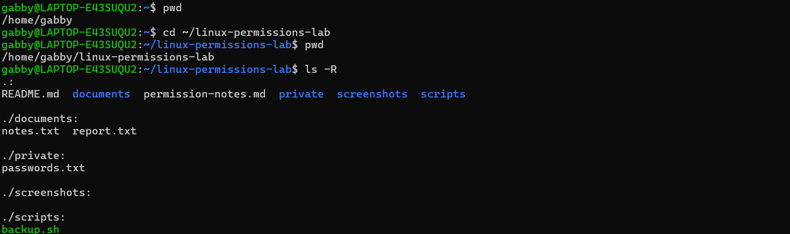
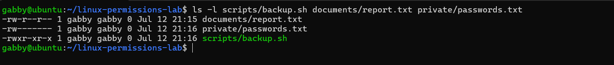
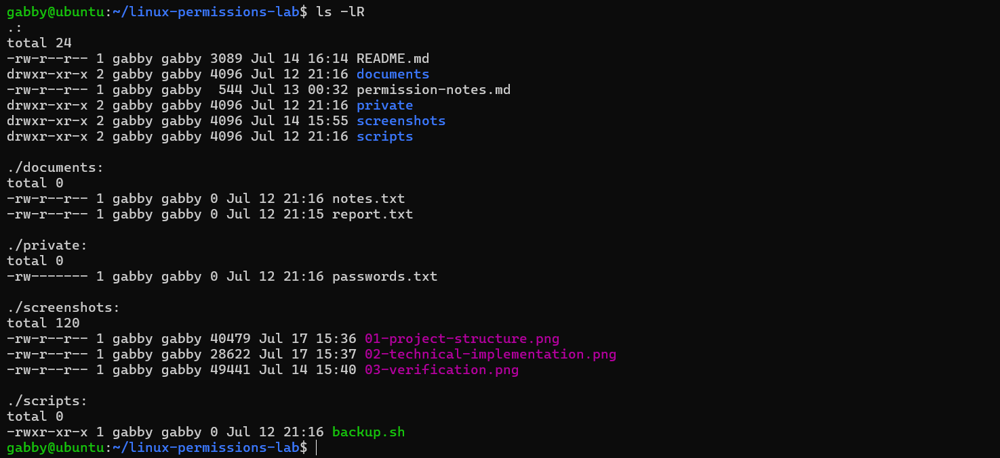

# 🔐 Linux Permissions & Ownership

## Overview

This project simulates troubleshooting Linux file access issues caused by incorrect permissions and ownership. The objective was to restore appropriate access, apply least-privilege permissions, and verify each change using standard Linux administration tools.

**Status:** ✅ Complete

---

## Skills Demonstrated

- Linux file permissions and ownership
- Access control and least privilege
- Symbolic and numeric permissions
- Command-line troubleshooting
- Technical documentation
- Git and GitHub workflow

---

## Tools Used

- Ubuntu 26.04 LTS (WSL2)
- Bash
- Git
- GitHub
- Visual Studio Code

---

## Scenario

This project simulates investigating why a user could no longer access important files or execute a backup script after file permissions had been modified.

The solution involved reviewing Linux file permissions, ownership, and access rights, restoring execute permission where required, applying least-privilege permissions, and verifying every change using standard Linux administration tools.

---

## What I Did

- Reviewed symbolic (`rwx`) and numeric (`755`, `644`, `600`) Linux permissions
- Restored execute permission to a backup script
- Applied least-privilege permissions to shared and sensitive files
- Verified permission changes using `ls -l`
- Confirmed proper file access after each modification

### Key Commands

```bash
ls -l
chmod u+x scripts/backup.sh
chmod 755 scripts/backup.sh
chmod 644 documents/report.txt
chmod 600 private/passwords.txt
```

---

## Verification

The solution was verified by comparing file permissions before and after each change and confirming that only authorized users retained the intended level of access.

### Verification Results

| File | Permissions | Purpose |
|------|-------------|---------|
| `backup.sh` | `755` (`rwxr-xr-x`) | Executable backup script |
| `report.txt` | `644` (`rw-r--r--`) | Shared report document |
| `passwords.txt` | `600` (`rw-------`) | Owner-only sensitive file |

---

## Screenshots

### Project Structure



---

### Technical Implementation



---

### Verification



---

## Key Takeaways

This project reinforced that symbolic and numeric permissions represent the same Linux permission model in different formats. It also demonstrated that execute permission is required for scripts to run and highlighted the importance of verifying every permission change rather than assuming a command completed successfully.

Working through this scenario strengthened my understanding of how permissions and ownership work together to protect systems while allowing authorized users to perform their tasks efficiently.

---

## Next Steps

- Implement POSIX Access Control Lists (ACLs)
- Demonstrate recursive permission management
- Automate permission auditing with Bash
- Extend the project to an AWS EC2 Linux instance