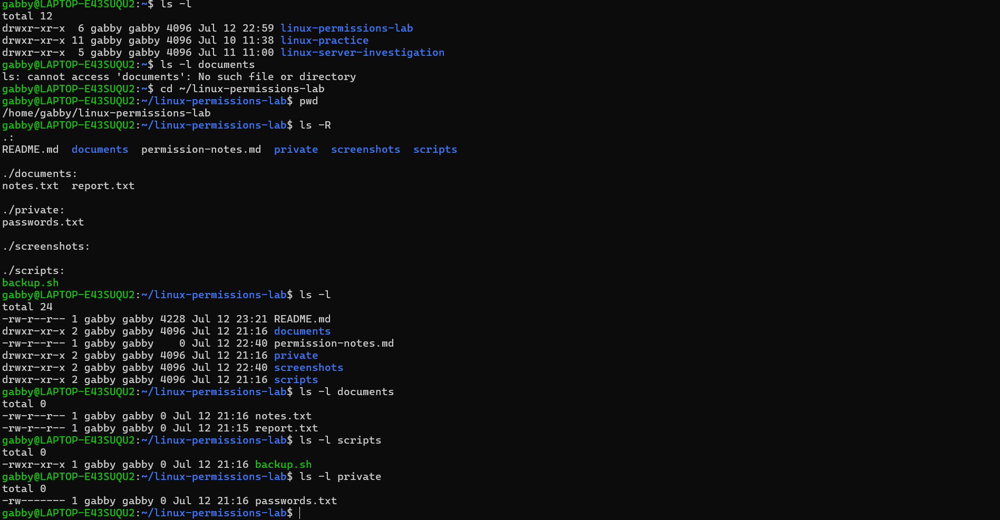

# Linux Permissions & Ownership | Cloud Support Portfolio Project

A hands-on Cloud Support portfolio project demonstrating Linux file permissions, ownership, access control, and security best practices using Ubuntu (WSL), Git, and GitHub.

---

## Table of Contents

- [Overview](#overview)
- [Objectives](#objectives)
- [Scenario](#scenario)
- [Skills Demonstrated](#skills-demonstrated)
- [Environment & Tools](#environment--tools)
- [Project Structure](#project-structure)
- [Project Screenshots](#project-screenshots)
- [Permission Investigation](#permission-investigation)
- [Key Findings](#key-findings)
- [Lessons Learned](#lessons-learned)
- [Real-World Application](#real-world-application)
- [Project Status](#project-status)

---

## Overview

This project demonstrates how Linux file permissions and ownership control access to files and directories. It explores symbolic and numeric permissions, verifies permission changes, and applies troubleshooting techniques commonly used by Cloud Support Engineers and Linux administrators.

The project also reinforces security best practices by applying the principle of least privilege to sensitive files.

---

## Objectives

- Understand Linux file permissions.
- Interpret symbolic permissions (`rwx`).
- Use `chmod` to modify permissions.
- Understand numeric permissions (`755`, `644`, `600`).
- Verify permissions using `ls -l`.
- Practice documenting a technical investigation.

---

## Scenario

### Support Request

A user reported they could no longer access certain files or execute a backup script after changing file permissions.

As the Cloud Support Engineer, I investigated the file permissions, verified access levels using Linux command-line tools, corrected the permission settings, and documented the findings.

---

## Skills Demonstrated

- Linux file permissions
- File ownership concepts
- Access control
- Symbolic permissions (`rwx`)
- Numeric permissions (`755`, `644`, `600`)
- Linux command-line troubleshooting
- Technical documentation
- Git and GitHub workflow

---

## Environment & Tools

- Ubuntu (WSL)
- Visual Studio Code
- Git
- GitHub
- Linux Terminal
- `chmod`
- `ls`
- `touch`
- `mkdir`

---

## Project Structure

```text
linux-permissions-lab/
├── README.md
├── permission-notes.md
├── documents/
│   ├── report.txt
│   └── notes.txt
├── private/
│   └── passwords.txt
├── scripts/
│   └── backup.sh
└── screenshots/
```

---

## Project Screenshots

### Project Structure


The project structure separates documentation, scripts, files, and screenshots into an organized layout.

### Permission Verification



Linux permissions were verified before and after permission changes using `ls -l`.

### README Preview


The completed README documents the investigation, findings, and lessons learned.

---

## Permission Investigation

### Files Reviewed

| File | Permissions | Purpose |
|------|-------------|---------|
| `backup.sh` | `755` (`rwxr-xr-x`) | Executable backup script |
| `report.txt` | `644` (`rw-r--r--`) | Shared report document |
| `passwords.txt` | `600` (`rw-------`) | Sensitive file accessible only by the owner |

### Commands Used

```bash
ls -R
ls -l
chmod u+x scripts/backup.sh
chmod 755 scripts/backup.sh
chmod 644 documents/report.txt
chmod 600 private/passwords.txt
```

The permission changes were verified before and after each modification using `ls -l`.

---

## Key Findings

- Verified executable scripts require execute permissions to run.
- Confirmed shared documents should use `644` permissions.
- Applied `600` permissions to protect sensitive information.
- Verified all permission changes using `ls -l`.
- Reinforced the principle of least privilege for secure file access.

---

## Lessons Learned

This project strengthened my understanding of Linux file permissions and ownership. I learned how symbolic and numeric permissions work together to control access to files and directories.

I also reinforced the importance of verifying every permission change using `ls -l` rather than assuming the command completed successfully. Documenting each step of the investigation demonstrated how technical documentation supports troubleshooting and knowledge sharing.

---

## Real-World Application

Cloud Support Engineers and Linux administrators regularly manage file permissions to protect sensitive information, troubleshoot access issues, and ensure applications have the correct level of access. Understanding Linux permissions is a fundamental skill for securing systems and maintaining reliable operations.

---

## Project Status

**Status:** ✅ Complete

**Completed:** July 2026

**Version:** 1.0

**Author:** Gabriell Bedoy
